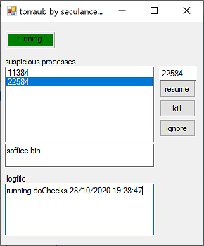

# torraubpoc

torraub is a tool to stop ransomware attacks when an infection has already happened end encryption is starting.

IMPORTANT: THIS IS AN VERY EARLY POC SOFTWARE PROJECT MEANT FOR RESEARCH / TESTING ONLY. CURRENTLY IT DOES NOT OFFER REALIABLE SECURITY!

 

## How does torraub work?
torraub periodically checks all running processes for their file activity. processes showing suspicious behaviour can be whitelisted (ignored), suspended or killed by the user. The idea behind that approach is to not stop an infection before 2nd stage malware kicks in (such as my ProcessBouncer does) but to stop the 2nd stage malware encrypting the file system. When a malicious process is suspended / killed that way, some files will be lost because they have already been encrypted. But the malicious process has hopefully been blocked after showing some significant file system activity.

## TODOs
* Logfile
* History Textbox
* suspend currently not working
* better checks to determine whether a process is suspicious (see also ProcessBouncer checks)
* ...

Why 'torraub'?
Torraub is an austrian term for performing an emergency brake in football/soccer (https://en.wikipedia.org/wiki/Professional_foul).
I'm neither from Austria nor interested in football - as long as it is not american football / NFL. 
My torraub is a deliberate act of foul play on the process level intended to bring about an advantage in the fight against ransomware.

Please refer to https://github.com/hjunker/ProcessBouncer on how to support / contribute to my projects.
